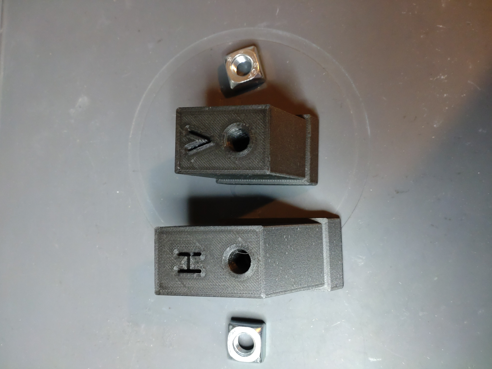
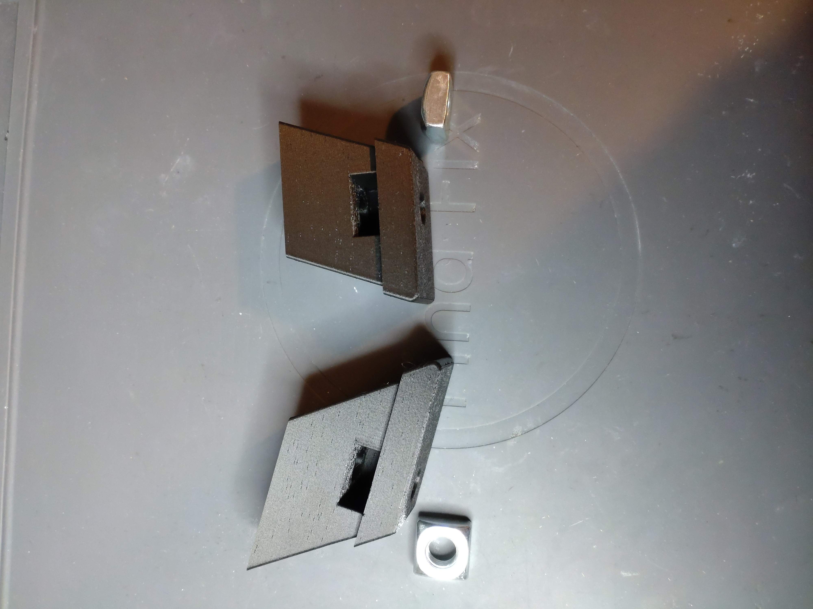
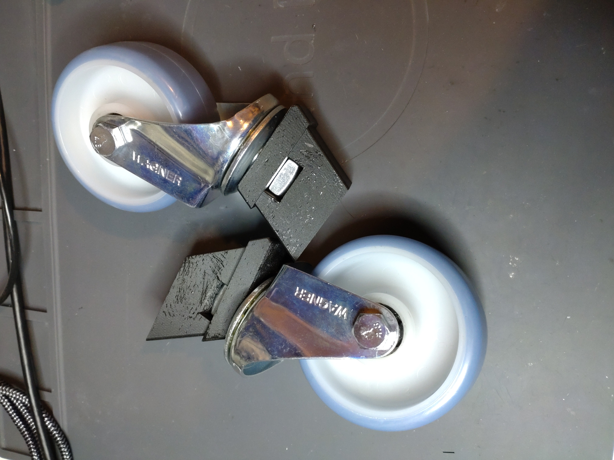
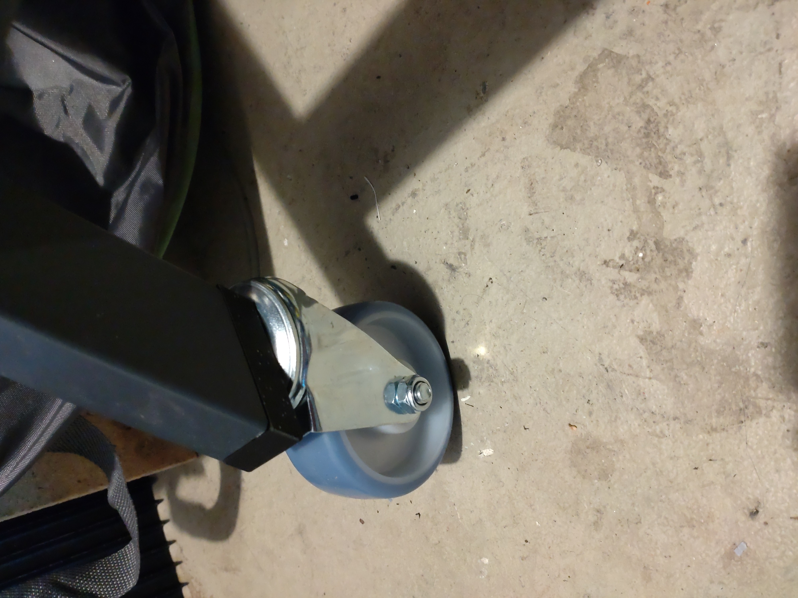
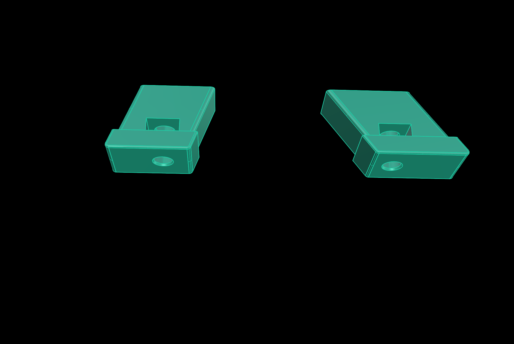
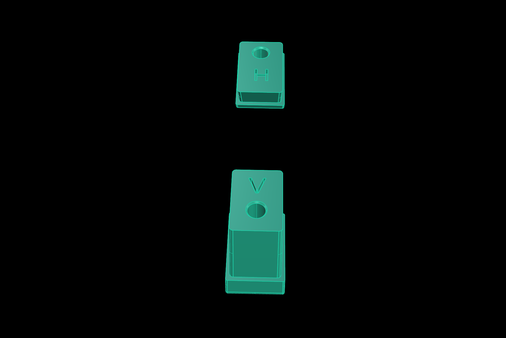

# wolfcraft-workbench-wheelholder
3D printable holders to mount wheels on a Wolfcraft workbench to move it around. Created with Rhino 8.

I had 4 wheels laying around and decided, to make my Wolfcraft workbench movable. 
The stands of the workbench have a 70° and a 55° angle. Print two of each holder. I recently received a 
Prusa MK4S printer with MMU3 and enclosure. I found the way how Prusa mounts parts together using square nuts
very usefull. I used 4 M10 square nuts for the wheels.

Requirements:
* 3D printer 
* PETG Filament of your choice
* 4 Wheels with M10 thread (Inbus)
* 4 M10 square nuts (17 x 17 x 8 mm)

## View

 

  

